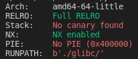
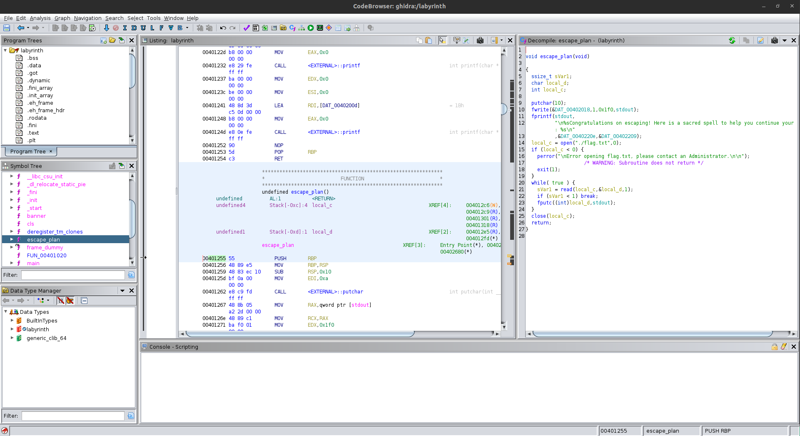

# 4 - Labyrinth

For the first input by looking with Ghidra it is enough to insert `69` as answer.

For the second input the goal is to overwrite the return address with the one of the `escape_plan` function.

