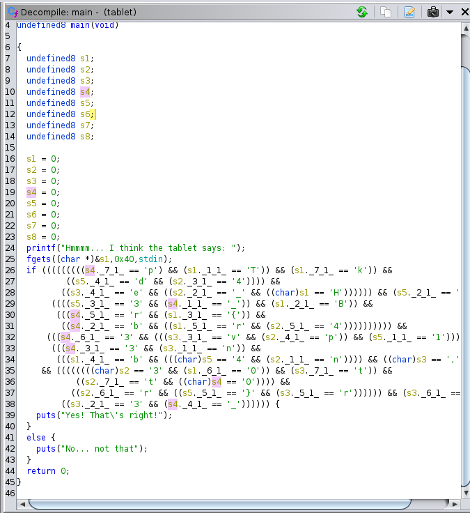

# Reversing 01 - Shattered tablet

By looking to the decompiled code with Ghidra is possible to see the expected input.
The flag is long 64 characters and there is an if condition for each character of the flag.

To reconstruct the flag it is enough to copy and past the code, replace equality with assignments, and fix the array syntax.



```
HTB{br0k3n_4p4rt,n3ver_t0_b3_r3p41r3d}
```
