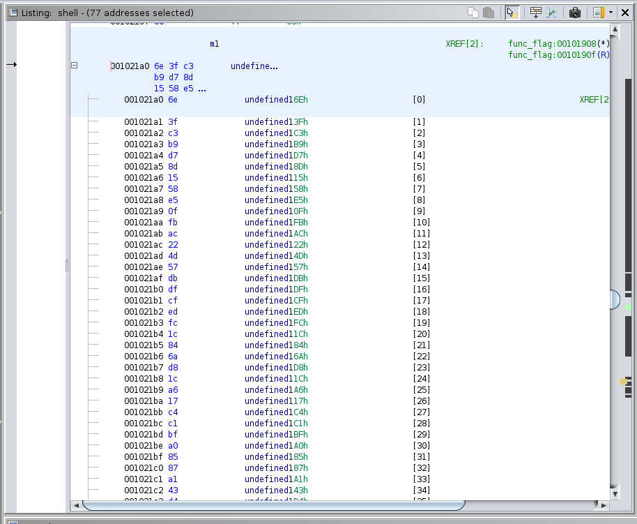
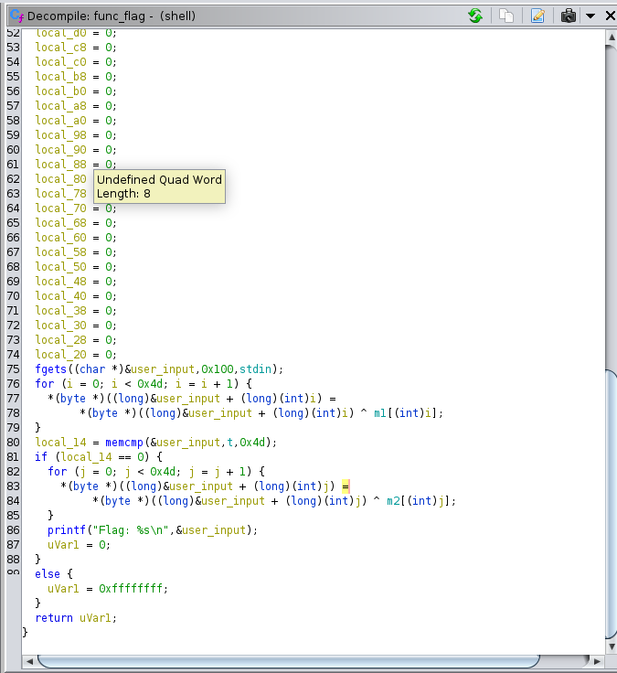

# Reversing 02 - C Shells

The flag is obtained by xoring the input password with some constant values.
It is possible to read their values from the binary and then retriving the flag.




```
HTB{cr4ck1ng_0p3n_sh3ll5_by_th3_s34_sh0r3}
```
