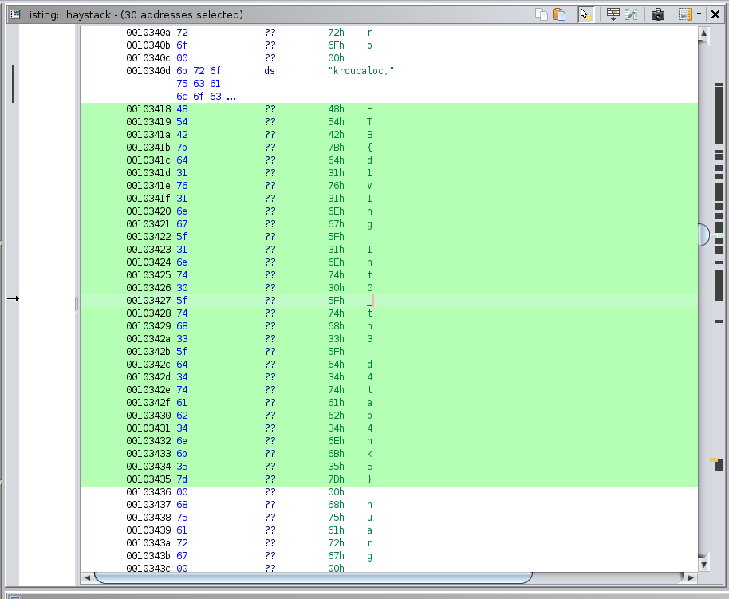

# Reversing 03 - Needle in a Haystack

The binary reads strings from random addresses.

By looking into the rodata section it is possible to find the flag.



```
HTB{d1v1ng_1nt0_th3_d4tab4nk5}
```
