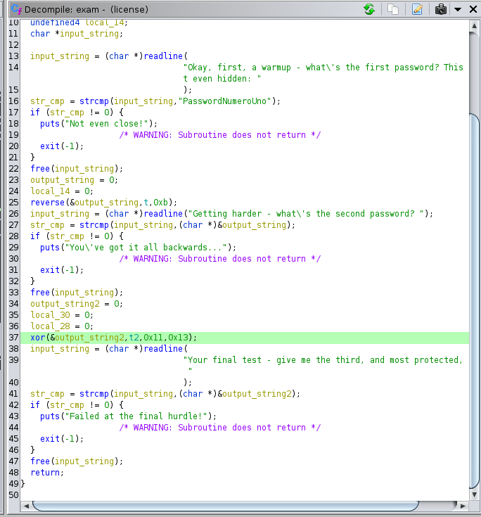

# Reversing 04 - Hunting License

The goal is to find three passwords and reply to some questions about the binary.

The first password is in clear in the binary, the second is reversed, and the final one must be xored.

For the questions is enough to use ldd, ghidra, and readelf.



```
HTB{l1c3ns3_4cquir3d-hunt1ng_t1m3!}
```
