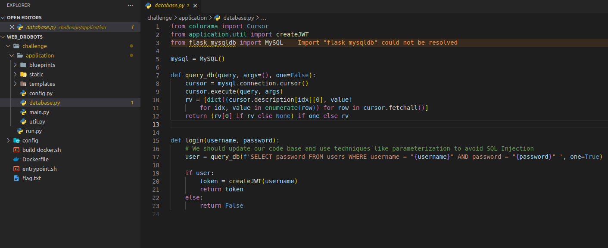
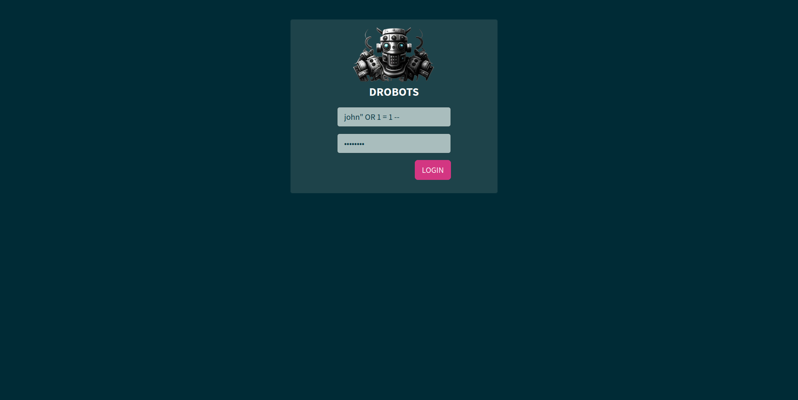
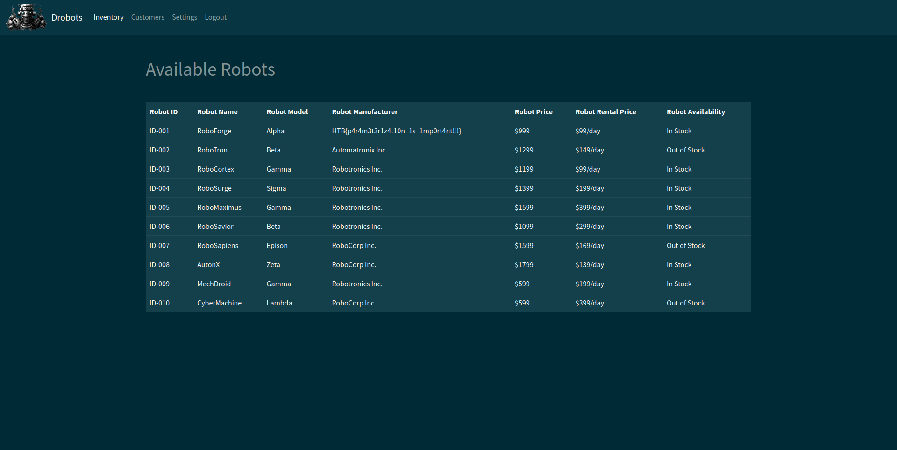

# Web 03 - Drobots

There is a SQLi vulnerability in the server code. It is possible to inject SQL code using the field username and password for login.

By using as username like `john" OR 1=1` it is possible to login inside the app.

