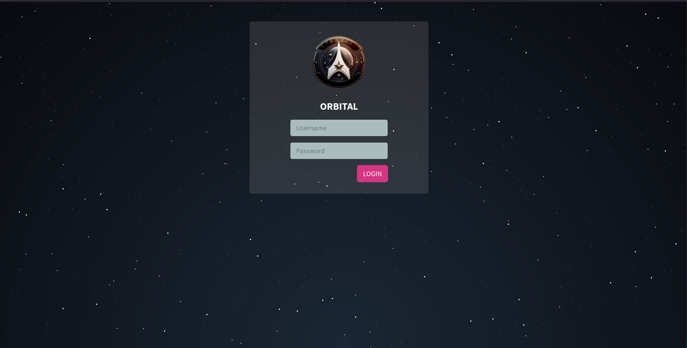

# Web 05 - Orbital

SQLi + file path traversal

For the SQL injection there is no sanity check on the login fields.
It is possible to inject a SQL code to login as admin with password "admin".
Also, the password injected in the query must be the hashed version identical to the one made for password check.

```
john" UNION SELECT username, "21232f297a57a5a743894a0e4a801fc3" as password FROM users LIMIT 1 --
```

For the file path traversal is possible to read directly the flag by exploiting the export endpoint.
There is to be careful about the file, it is changed with `signal_sleuth_firmware` by looking in the docker file.


